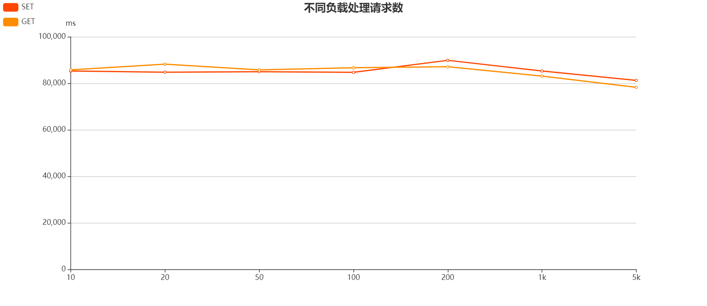
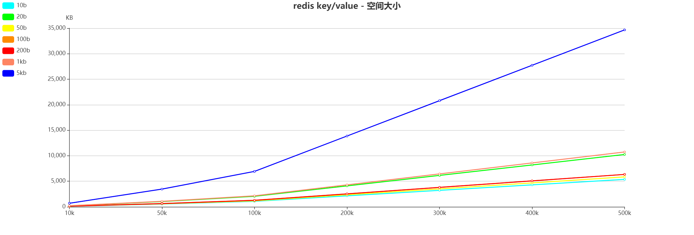

### 1、使用 redis benchmark 工具, 测试 10 20 50 100 200 1k 5k 字节 value 大小，redis get set 性能。

|            |   SET    |   GET    |
| :--------: | :------: | :------: |
|  10 bytes  | 81900.09 | 83822.30 |
|  20 bytes  | 86132.64 | 87108.02 |
|  50 bytes  | 87412.59 | 87032.20 |
| 100 bytes  | 85324.23 | 86655.11 |
| 200 bytes  | 84104.29 | 87032.20 |
| 1024 bytes | 87412.59 | 86730.27 |
| 5120 bytes | 80385.85 | 82508.25 |

- value 过大(>1024byte) 或过小 (< 100byte) 都会对 Redis 性能产生影响

### 2、写入一定量的 kv 数据, 根据数据大小 1w-50w 自己评估, 结合写入前后的 info memory 信息  , 分析上述不同 value 大小下，平均每个 key 的占用内存空间。

|      |    10b     |    20b     |    50b     |    100b    |    200b    |    1kb     |    5kb     |
| :--: | :--------: | :--------: | :--------: | :--------: | :--------: | :--------: | :--------: |
| 10k  | 107.422 KB | 205.078 KB | 117.188 KB | 126.953 KB | 126.953 KB | 214.844 KB | 693.359 KB |
| 50k  | 537.109 KB |  1.001 MB  | 585.938 KB | 634.766 KB | 634.766 KB |  1.049 MB  |  3.386 MB  |
| 100k |  1.049 MB  |  2.003 MB  |  1.144 MB  |  1.240 MB  |  1.240 MB  |  2.098 MB  |  6.771 MB  |
| 200k |  2.098 MB  |  4.005 MB  |  2.289 MB  |  2.480 MB  |  2.480 MB  |  4.196 MB  | 13.542 MB  |
| 300k |  3.147 MB  |  6.008 MB  |  3.433 MB  |  3.719 MB  |  3.719 MB  |  6.294 MB  | 20.313 MB  |
| 400k |  4.196 MB  |  8.011 MB  |  4.578 MB  |  4.959 MB  |  4.959 MB  |  8.392 MB  | 27.084 MB  |
| 500k |  5.245 MB  | 10.014 MB  |  5.722 MB  |  6.199 MB  |  6.199 MB  | 10.490 MB  | 33.855 MB  |

- 200byte 与 100byte 占用空间大小相同, 猜测可能是 jemalloc 内存分配优化有关
- 小于 200byte 时, 除 20byte 外, 其它大小 kv 占用空间大小相近
- 20byte 时, 空间占用约为 10byte, 50byte 的两倍, 猜测可能是内存碎片及对齐带来的问题
